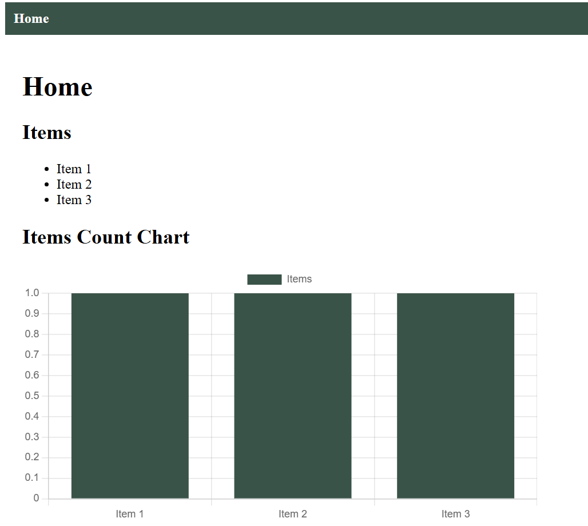

# Flask, Vue application template

Full stack application template developed with Flask & SQLAlchemy ORM (using scaffolding), Vue & Axios, PostgrSQL, and Docker

## How to run

1. Clone the repository
2. Ensure Python and Docker Desktop are installed on your machine
3. In the terminal, run the command `docker-compose up --build`
4. Initialize database. This can be done in 2 ways:
    a. In the Docker backend container, navigate to exec and run `python init_db.py`
    b. In the terminal, run `docker exec -it flask-vue-template-backend-1 python init_db.py`

### Dev notes
- Use the command `docker-compose down -v` to reinstall dependencies
- Note: auto refresh is not available (yet)

### Preview

